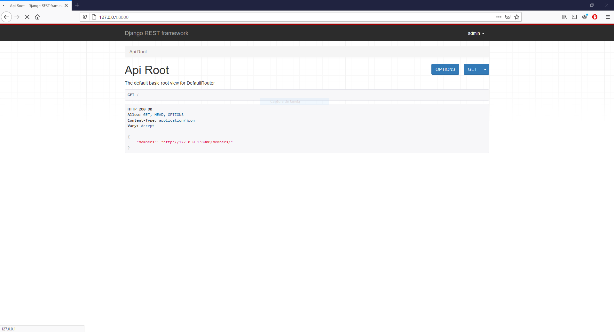
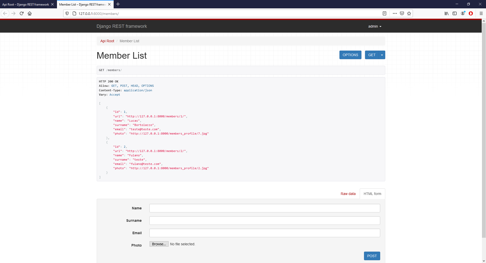
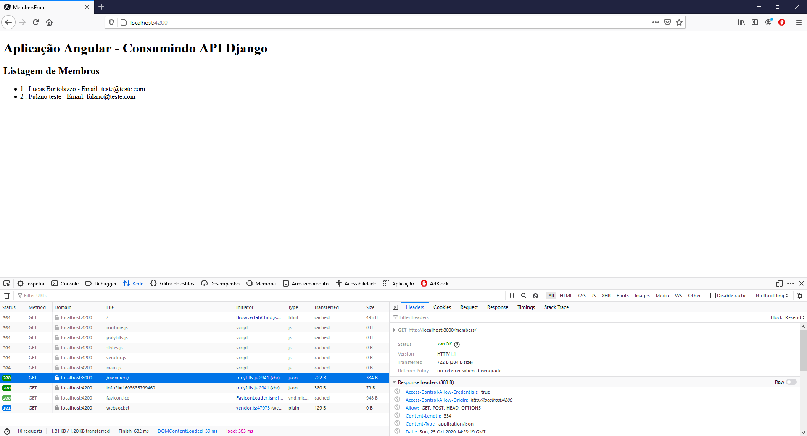

# Django Rest Framework com Angular
Aplicação para estudo utilizando Django Rest para o backend e Angular para o frontend.

## Features

1. Aplicação em Angular consumindo API feita com Django Rest

## Preview

### Cadastro de Membros
 

### Servidor em execução
 

### Listagem de Membros
 

### Aplicação Angular consimundo API Django
 

 
## Main requirements

* Django==3.1.2
* django-cors-headers==3.5.0
* djangorestframework==3.12.1
* Pillow==8.0.1
* pytz==2020.1
* sqlparse==0.4.1
